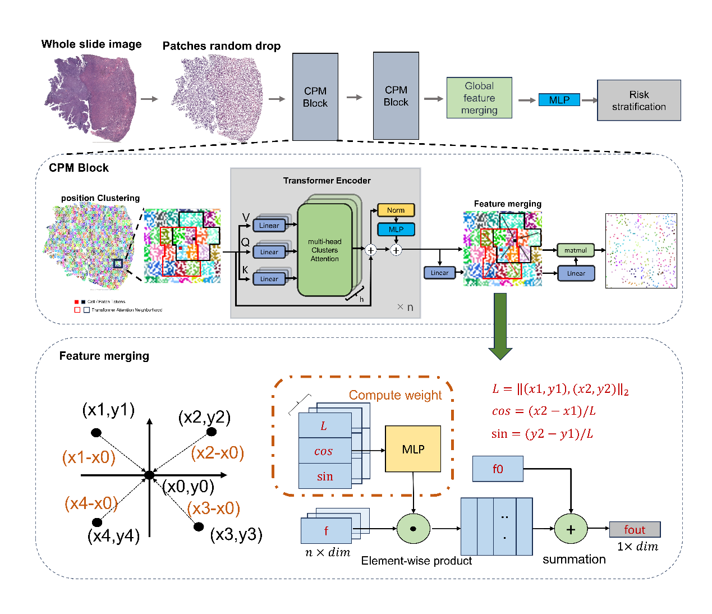
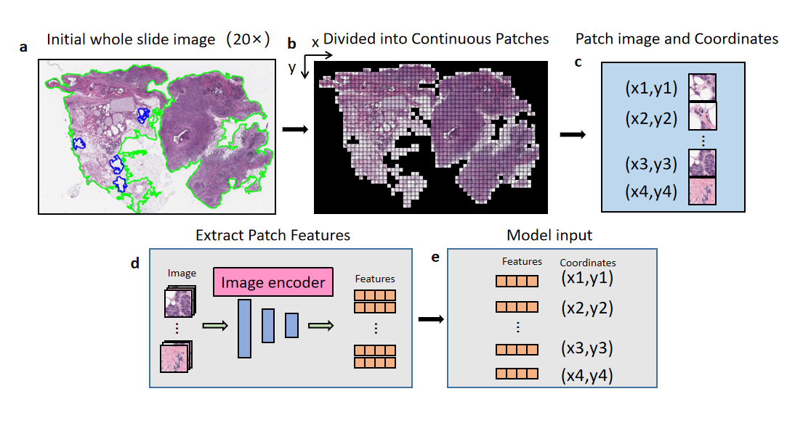

# PathoFocus

[](clusten/)

## Introduction

Histopathological assessment of whole slide images (WSIs) is essential for understanding disease pathology, patient PathoFocus is a position-guided transformer model designed for pathology image prognosis prediction. It segments WSIs, assigns attention scores, and focuses on clinically relevant regions, improving prognosis accuracy across multiple cancer types. Validated on three datasets, PathoFocus advances pathology image-based prognosis prediction.

<div align="center">
  
</div><br/>

## Main Results on TCGA data

| FOLD | 1     | 2     | 3     | 4     | MEAN |
|------|-------|-------|-------|-------|------|
| **BLCA**  |       |       |       |       |      |
| C-index | 0.532 | 0.582 | 0.664 | 0.640 | 0.605 |
| P-value | 0.048 | 0.031 | 0.001 | 0.018 | 0.024 |
| **BRCA**  |       |       |       |       |      |
| C-index | 0.658 | 0.524 | 0.728 | 0.622 | 0.633 |
| P-value | 0.001 | 0.021 | 0.014 | 0.046 | 0.021 |
| **LUAD**  |       |       |       |       |      |
| C-index | 0.631 | 0.693 | 0.650 | 0.570 | 0.636 |
| P-value | 0.024 | 0.001 | 0.010 | 0.050 | 0.021 |
| **UCEC**  |       |       |       |       |      |
| C-index | 0.787 | 0.780 | 0.639 | 0.659 | 0.716 |
| P-value | 0.001 | 0.001 | 0.045 | 0.011 | 0.014 |

## Getting Started

### Clone this repo

```bash
git gh repo clone Zhang-2000/PathoFocus
cd pathofocus
```

### Create environment and install requirements

```bash
sh create_env.sh
```

### Prepare data

<div align="center">
  
</div><br/>

[Tissue segmentation+Patch divide](https://github.com/mahmoodlab/CLAM)

```bash
python create_patches_fp.py \
--source DATA_DIRECTORY \
--save_dir RESULTS_DIRECTORY \
--patch_size 256 --seg --patch --stitch 
```

[Extract patch feature]((https://github.com/mahmoodlab/HIPT.git))
Use "model256" for feature extracting
```bash
python extract_features_fp.py \
--data_h5_dir DATA_DIRECTORY \
--data_slide_dir SLIDE_DIRECTORY \
--feat_dir FEAT_DIRECTORY \
--batch_size 256 --slide_ext .svs --model hipt
```

For standard folder dataset, The file structure should look like:
```bash
$ tree dataset
TCGA_xxxx/
├── raw_data
│   ├── TCGA-xx-xx.svs
│   ├── TCGA-xx-xx.svs
│   └── ...
└── label
    ├── fold1.csv
    ├── fold2.csv  
    ├── fold3.csv  
    └── fold4.csv
TCGA_xxxx/
└─...

```

### Train and evaluate

```bash
# dataset path
DATA=/workspace/ssl/HVTSurv/UCEC/raw_data/patch_result/feature/h5_files/
# config file path
CONFIG=configs/config.yaml
python -main.py \
    --data-path $DATA \
    --cfg $CONFIG \
```
for training or evaluation.

